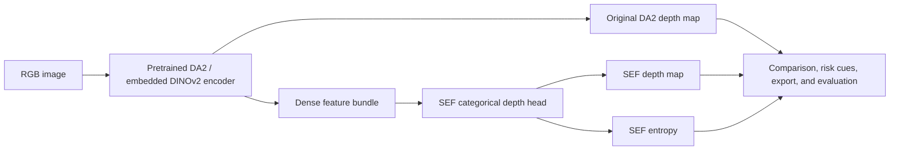

# DepthLab

DepthLab is a reproducible research and demonstration framework for monocular
depth estimation. It extends the pretrained **Depth Anything V2 Small** (DA2)
backbone with pluggable prediction heads, uncertainty tooling, temporal
controls, and evidence-driven evaluation.

## Architecture



The DA2 checkpoint is pretrained; DepthLab does not train it from scratch. The
Surface Existence Field (SEF) head was trained locally on NYU Depth V2, then
the combined model was fine-tuned end to end. The repository also contains
small, modular primitives for scene adaptation, temporal geometry, streaming
depth, sparse depth fields, calibrated fusion, and uncertainty calibration.

## Local Result

On the local 290-image NYU validation split, evaluated with per-image
scale-and-shift alignment:

| Model | AbsRel | RMSE | delta1 |
| --- | ---: | ---: | ---: |
| DA2 Small | 0.2264 | 0.7641 | 0.6448 |
| DA2 + SEF | **0.2069** | **0.6863** | **0.6731** |

This is a local reproducibility result, not an official NYU benchmark claim.

## Quick Start

Install project and upstream dependencies in a Python virtual environment,
then place the DA2 Small checkpoint at `checkpoints/depth_anything_v2_vits.pth`.

```powershell
pip install -r requirements.txt
pip install -r depth-anything-v2-official/requirements.txt
python -m pytest -q
python verify.py
streamlit run dashboard.py
```

The Streamlit dashboard compares DA2 and SEF predictions on the included NYU
sample or an uploaded image. Its risk page provides an **illustrative** overlay
based on SEF entropy and DA2/SEF disagreement. It is deliberately not presented
as a safety guarantee until a held-out calibration artifact meets its declared
false-usable-rate target.

## Product Demo

<video controls preload="metadata" width="960">
  <source src="https://github.com/user-attachments/assets/7f857582-91e6-41d7-95ae-f74c1786449e" type="video/mp4">
  Your browser does not support embedded video.
</video>

The 75-second product demo shows the RGB-to-depth comparison, local NYU result,
and clearly labelled illustrative risk cues.

## Data and Experiments

Prepare local RGB-D data with the manifest schema, then preflight before
training:

```powershell
python scripts/prepare_depth_manifest.py --input local.csv --output data/depth_manifest.csv
python scripts/preflight.py --config config/sef_warmup.yaml
.\scripts\run_research_pipeline.ps1
```

For trusted temporal RGB-D controls, download TUM `freiburg1_xyz`:

```powershell
python scripts/download_tum_rgbd.py
```

See [TUM RGB-D reproduction notes](docs/reproduction/tum-rgbd.md) for data
provenance, poses, and licensing guidance.

## Evidence Status

The platform code, local NYU run, TUM temporal manifest workflow, and dashboard
are implemented. The public six-stratum failure benchmark remains intentionally
unfrozen: it requires 1,200 real, licensed, human-reviewed samples with full
provenance. Synthetic renders and NYU alone cannot close that research gate.

Read [IMPLEMENTATION_STATUS.md](IMPLEMENTATION_STATUS.md) for the current
verified scope and remaining external evidence requirements.
